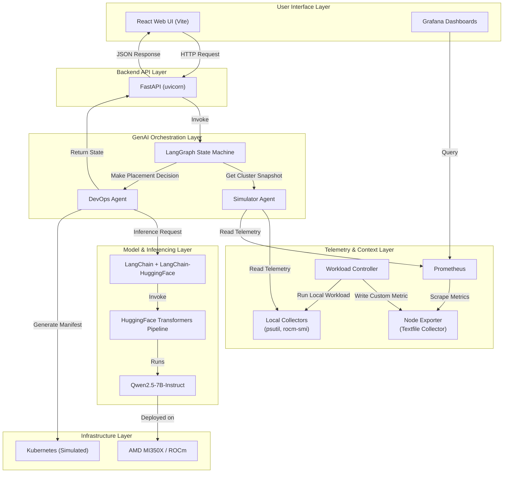

# SOWA Architecture Document

## 1. Overview
SOWA (Self-Optimizing Workload Agent) is a GenAI-powered Kubernetes workload placement demo for AMD hardware. It combines real-time telemetry, multi-agent orchestration, explainable AI decisions, and beautiful pre-built Grafana dashboards—all with a **true one-click setup script**!

## 2. Full Stack Architecture Diagram

## 3. Technology Stack
| Layer               | Technologies                                                                 |
|---------------------|-----------------------------------------------------------------------------|
| **UI**              | React (Vite), Grafana                                                       |
| **Backend API**     | FastAPI, uvicorn, pydantic                                                 |
| **Orchestration**   | LangGraph, LangChain                                                         |
| **Inferencing**     | HuggingFace Transformers, Accelerate, PyTorch, Qwen2.5-7B-Instruct          |
| **Telemetry**       | psutil, rocm-smi, Prometheus, Node Exporter (Textfile Collector), requests  |
| **Hardware**        | AMD EPYC, AMD Instinct MI350X, ROCm                                         |
| **Language**        | Python 3.x (Backend), JavaScript/TypeScript (Frontend)                            |
| **Setup Script**    | `setup_and_run.py`: One-click complete setup!                              |

## 4. Key Components

### 4.1 One-Click Setup Script (`setup_and_run.py`)
This is the main entry point! It does EVERYTHING automatically:
1. Installs Python dependencies from `requirements.txt`
2. Installs Node.js/npm (if not found)
3. Installs Prometheus, Node Exporter, and Grafana
4. Builds the React frontend
5. Starts ALL services together
6. Monitors processes and cleans up gracefully on `Ctrl+C`

### 4.2 Backend API (`api.py`)
- FastAPI server that exposes REST endpoints
- Serves the React frontend static files (if built)
- Manages global state of the demo
- Exposes endpoints:
  - `GET /api/state`: Get current demo state
  - `POST /api/run-turn`: Run next simulation turn
  - `POST /api/trigger-gpu-spike`: Trigger a GPU spike event
  - `POST /api/run-current-workload`: Run current workload locally
  - `POST /api/refresh-telemetry`: Refresh telemetry
  - `POST /api/reset`: Reset the demo

### 4.3 Frontend (`frontend/`)
- Modern, dark-themed React UI built with Vite
- Communicates with FastAPI backend via HTTP
- Displays:
  - Current workload
  - Placement decision
  - DevOps reasoning
  - Performance summary
  - Kubernetes manifest
  - Live telemetry
  - Risk level

### 4.4 Telemetry System (`sowa/metrics.py`)
Supports two modes (Prometheus is recommended):
1. **Local Mode (fallback)**: Uses `psutil` (CPU/memory) and `rocm-smi` (GPU)
2. **Prometheus Mode**: 
   - Queries Prometheus via PromQL for node CPU/memory
   - Uses custom textfile collector metrics (`sowa_gpu_spike_active`, `sowa_gpu_spike_recent`) for GPU contention events
   - Telemetry source and event text clearly indicate Prometheus usage

### 4.5 Workload Controller (`sowa/workloads.py`)
Manages local demo workloads and writes custom Prometheus metrics:
- Runs CPU, Memory, or GPU stress jobs
- Triggers GPU spike events
- Writes `sowa_gpu_spike_active` and `sowa_gpu_spike_recent` metrics via Node Exporter textfile collector
- Tracks active jobs and recent spikes

### 4.6 GenAI Orchestration (`sowa/` Core)
- **LangGraph Workflow**: Two-agent system orchestrated by LangGraph
  1. **Simulator Agent** (`agents.py`):
     - Prepares context: Mixes real local telemetry with simulated cluster nodes
     - Selects next workload from predefined list
  2. **DevOps Agent** (`agents.py`):
     - Makes placement decision using telemetry
     - Generates Kubernetes manifest
     - Explains reasoning and performance impact
- **LLM Setup** (`llm.py`): Loads Qwen2.5-7B-Instruct via HuggingFace
- **State Management** (`state.py`): `MultiAgentState` TypedDict for passing data between agents

## 5. GenAI Fundamentals & Principles Used

### 5.1 Multi-Agent Systems
Two-agent system orchestrated by LangGraph for clear separation of concerns

### 5.2 Retrieval-Augmented Generation (RAG) / Context Engineering
- **Telemetry as Context**: Real-time cluster state, CPU/GPU/memory usage, and events injected directly into the LLM prompt
- **No fine-tuning needed**: All decisions are context-driven

### 5.3 Structured Prompting
- **Role Prompting**: Explicitly defines LLM as "AI DevOps Orchestrator"
- **Rule-Based Prompting**: Enforces hardware preferences, load constraints, and contention avoidance
- **Structured Output Enforcement**: Forces LLM to return JSON with predefined keys:
  - `reasoning`, `decision`, `risk_level`, `performance_explanation`, `tool_trace_summary`

### 5.4 Output Normalization & Robustness
- **`_normalize_decision`**: Maps messy LLM outputs ("epyc", "GPU") to canonical node names
- **`_parse_structured_response`**: Robust JSON extraction with fallback logic

### 5.5 Explainable AI (XAI)
- Tracks and displays `tool_trace` for transparency
- Generates human-readable `devops_reasoning`
- Compares baseline placement to SOWA placement with `performance_summary`

### 5.6 Responsible AI / Safety
- Uses low temperature (0.2) for consistent decisions
- All generated manifests are demo-only (not applied to real clusters)
- GPU spike workloads are bounded (short duration)

## 6. Data Flow
1. User clicks "Run Next Simulation Turn" in React UI
2. React UI sends HTTP POST to `/api/run-turn` on FastAPI backend
3. FastAPI invokes LangGraph state machine
4. Simulator Agent:
   - Gets cluster snapshot (telemetry + simulated nodes)
   - Picks next workload
5. DevOps Agent:
   - Refreshes live telemetry
   - Injects all context into LLM prompt
   - Runs inference on Qwen2.5-7B
   - Parses and normalizes decision
   - Generates Kubernetes manifest
6. FastAPI returns updated state to React UI
7. React UI updates all components with new data
8. Prometheus scrapes telemetry from Node Exporter
9. Grafana displays real-time dashboards from Prometheus data

## 7. Future Work
- Real Kubernetes integration (apply manifests to real clusters)
- Prometheus Alertmanager webhook triggering
- Policy modes (Performance / Balanced / Eco)
- Multi-node real cluster support
