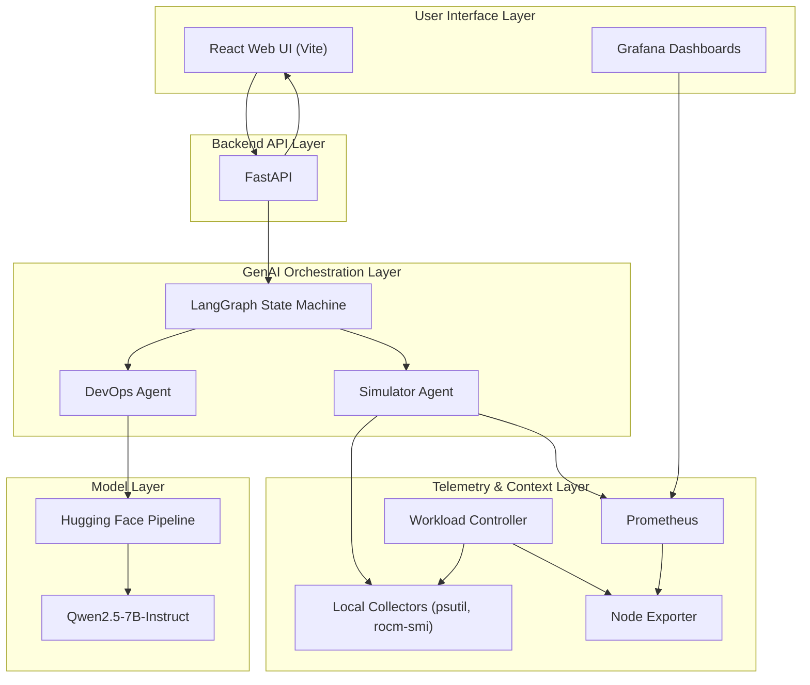

Project Name/Title:
SOWA: Self-Optimizing Workload Agent

Short Description:
SOWA is an explainable workload placement assistant for AMD infrastructure. It combines live notebook telemetry, simulated multi-node cluster state, an LLM-powered DevOps agent, and generated Kubernetes deployment YAML to recommend where a workload should run and explain why.

Problem Statement:
Modern platform teams still rely heavily on static infrastructure rules such as hand-written node affinity, taints, and hardcoded heuristics. Those approaches do not adapt well when clusters contain a mix of CPU-heavy nodes, general-purpose nodes, and high-value accelerators. Teams need a smarter way to place workloads based on current conditions while keeping the decision understandable to operators.

Target Users/Stakeholders:
- Platform engineering teams
- DevOps / SRE teams
- Infrastructure operations teams
- AI/ML platform owners managing heterogeneous compute
- Engineering leaders evaluating workload efficiency on AMD infrastructure

Why this problem matters/ business or operational relevance:
- Improves utilization of expensive accelerator capacity instead of relying on static placement rules
- Reduces scheduling mistakes caused by stale assumptions about node health or load
- Gives operators human-readable reasoning rather than opaque automation
- Helps teams compare baseline placement behavior versus a context-aware AI-assisted decision
- Demonstrates a practical path from telemetry to action without requiring live cluster mutation during a demo

Solution Architecture Diagram:

AI approach used (eg: GenAI, RAG, agents, vision, multimodal etc.):
- GenAI for reasoning and natural-language explanations
- Multi-agent workflow using LangGraph
- Context engineering / telemetry-grounded prompting
- Structured output prompting for decisions, risk, and performance explanation
- Deterministic fallback policy when the full LLM runtime is unavailable

Key technologies/ frameworks leveraged:
- Python, FastAPI, uvicorn, pydantic
- React + Vite frontend
- LangGraph and LangChain
- Hugging Face Transformers + LangChain HuggingFace integration
- PyTorch / ROCm-compatible execution path
- psutil and rocm-smi for local telemetry
- Prometheus, Node Exporter, Grafana
- Kubernetes deployment manifest generation

What was built duing the hackathon:
- A full-stack demo application with a professional React UI and FastAPI backend
- A two-step agent workflow:
  - `simulator_agent` to gather local telemetry and build a hybrid cluster snapshot
  - `devops_agent` to choose placement, explain the choice, and generate Kubernetes YAML
- Hybrid telemetry that mixes real local notebook CPU/memory/GPU signals with simulated remote node load
- Local workload triggers for CPU, memory, and GPU pressure
- A bounded real GPU spike flow that influences future placement decisions
- Prometheus textfile metrics for accelerator contention events
- Grafana-ready telemetry integration
- A one-click setup script for the AMD Developer Cloud style environment

Models used:
- Primary model: `Qwen/Qwen2.5-7B-Instruct`
- Runtime mode: Hugging Face text-generation pipeline with LangChain wrapper
- Fallback mode: deterministic rule-based scheduler when optional model dependencies are missing or model initialization fails

Number of tokens used for a couple of scenarios:
- Exact token counts are not currently instrumented in the prototype
- The current generation cap is `max_new_tokens=250`
- Prompt size varies by:
  - current workload request
  - live telemetry snapshot
  - simulated cluster status
  - recent accelerator event text
- For the submission, this should be treated as "not benchmarked/logged in the current hackathon build"

End-to-end-latency:
- Not formally benchmarked in the current prototype
- Practical behavior observed from the implementation:
  - API and telemetry refresh paths are lightweight
  - first-turn latency can be dominated by lazy model initialization and first model download
  - subsequent turns should be significantly faster once the model pipeline is loaded
- For judging, the relevant point is that the architecture supports an explainable turn-by-turn scheduling loop rather than a one-time static inference

GPU usage/ memory:
- Not formally benchmarked or persisted as submission metrics in the current build
- Target demo environment is optimized for AMD Developer Cloud hardware close to:
  - AMD MI350 class GPU
  - 192 GB VRAM
  - 10-13 CPU cores
  - 240 GB RAM
- GPU telemetry is read via `rocm-smi` when available
- The app can still run in CPU/fallback mode if accelerator access or optional dependencies are unavailable

Expected Impact or value (efficiency, productivity, scale, experience):
- Better placement efficiency for mixed CPU/GPU infrastructure
- Faster operator decision-making through explainable recommendations
- Lower risk of sending new AI workloads to already contended accelerator nodes
- Better visibility into how real telemetry changes scheduling choices
- Stronger stakeholder confidence because the system outputs both a decision and the reasoning behind it

Key differentiators/ innovation:
- Combines real notebook telemetry with simulated cluster state, making the demo realistic without needing a full live cluster
- Produces explainable scheduling decisions instead of opaque classification
- Generates deployment-ready Kubernetes YAML tied to AMD hardware labels
- Includes a real GPU spike interaction to show how live accelerator contention affects placement
- Uses a multi-agent orchestration pattern rather than a single monolithic prompt
- Remains resilient through a fallback deterministic scheduler if the full model stack is unavailable

Demo flow overview/ what the jury should notice:
1. Start on the SOWA dashboard and introduce the hybrid telemetry plus explainable placement concept
2. Click `Refresh Telemetry` to show the latest local CPU, memory, and GPU-aware state before making a decision
3. Click `Run Simulation Turn` to trigger workload selection, placement reasoning, risk scoring, and Kubernetes manifest generation
4. Show the selected workload, placement decision, telemetry source, DevOps reasoning, performance summary, and generated Kubernetes manifest
5. Explain that the manifest is a deployment-ready placement artifact tied to AMD hardware labels, even though the demo does not mutate a live cluster
6. Click `Trigger GPU Spike` to create a bounded local accelerator contention event
7. Wait a few seconds, then click `Refresh Telemetry`
8. Point out the `Recent Accelerator Event` signal in local telemetry and explain that live conditions are now different
9. Click `Run Simulation Turn` again to show that the scheduler re-evaluates placement under changed runtime conditions
10. Optionally click `Run Current Workload On Notebook` to create workload-shaped CPU, memory, or GPU pressure locally and then refresh telemetry again
11. If Grafana is available, switch to the SOWA dashboard and show that the same metrics pipeline is visible through an observability lens
12. Return to the SOWA UI and end by summarizing adaptive scheduling, explainability, and deployment-oriented output

3-min teleprompter script:
Hi, this is SOWA,
our Self-Optimizing Workload Agent
for explainable workload placement on AMD infrastructure.

SOWA helps platform teams
place workloads more intelligently
across CPU nodes,
GPU nodes,
and general-purpose infrastructure.

Instead of relying only
on static scheduling rules,
SOWA combines live telemetry,
workload type,
and AI-driven reasoning
to recommend the best target
and generate a Kubernetes deployment artifact.

On this screen,
we can see the current workload,
the placement decision,
the risk level,
and the telemetry source.

First,
I’m refreshing telemetry
so the system starts
from the latest local state.

SOWA reads local CPU and memory usage,
and when available,
AMD GPU telemetry through ROCm tools.

It combines that
with a simulated cluster snapshot,
so we can demonstrate
multi-node scheduling behavior
inside a compact demo environment.

Now I’m running
a scheduling turn.

At this point,
SOWA evaluates the incoming workload,
checks current resource conditions,
and selects a placement target.

It also produces
human-readable reasoning,
a performance summary,
and a Kubernetes manifest
that maps the workload
to the selected AMD hardware profile.

This makes the output useful
not only for explainability,
but also for operational handoff
and deployment planning.

Next,
I’m going to simulate
a GPU contention event.

This is important
because it lets us show
that SOWA responds
to changing runtime conditions
instead of following
fixed assumptions.

After a short wait,
I’ll refresh telemetry.

Now we can see
the recent accelerator event
showing up in the live telemetry.

I’ll run another scheduling turn
so we can observe
how placement adapts
under the updated conditions.

This demonstrates
the core value of SOWA.

The scheduler is adaptive,
explainable,
and driven by live infrastructure signals.

Optionally,
I can also run
the current workload locally.

That creates workload-shaped
CPU, memory, or GPU pressure
on the notebook node,
which gives us another way
to demonstrate dynamic response
in the telemetry pipeline.

To complement the SOWA interface,
we also provide
Grafana-based observability.

Grafana shows
the metrics pipeline behind the demo,
while the SOWA UI focuses on
decision-making,
reasoning,
and deployment output.

Together,
these views show
both what is happening in the system
and why the scheduling decision was made.

In summary,
SOWA combines
AMD-aware workload placement,
real-time telemetry,
explainable AI reasoning,
and Kubernetes-ready artifacts
into one operator workflow.

Thank you for watching.
